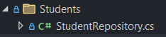
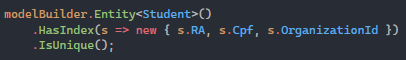
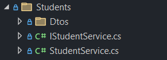
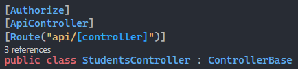

# Decisão da Arquitetura utilizada - Backend
Optei por utilizar uma arquitetura semelhante à Clean Architecture. Utilizei camadas definidas por pastas. 

A ideia principal era construir algo robusto porém levando em consideração ser um projeto pequeno, com isso em mente sabia que não precisava ser uma solução com múltipos projetos, nada que fosse muito complexo, já que os limites estavam bem definidos.

## Com isso em mente pensei nas seguintes camadas:
 - ### Models (Domain)
    - Onde organizei as entidades da aplicação, e as interfaces para que os repositórios às implementassem
    - Criei uma interface IBaseRepository, localizada em **Models/Shared/**  que contém as operações que considerei básicas para o funcionamento de um CRUD, o que evita a duplicação de código para cada model.
    - Também criei as intefaces ISoftDelete e IMustHaveOrganizationId, estas que são utilizadas em _Global Query Filters_ do Entity Framework Core, localizadas em **Models/Shared/**
        - ISoftDelete foi criada por dois motivos, um mecanismo de backup para caso algum registro seja excluído por engano, algo que já me ajudou em minha carreira como desenvolvedor e a **principal**, fazer com que os RAs dos Alunos nunca repitam, até mesmo se um aluno for excluído, eu considero todos os RAs que já foram gerados para aquela organização, para garantir que um novo RA não entre em conflito com nenhum outro no futuro.
        - IMustHaveOrganizationId foi criada em um mecanismo MultiTenancy. Com esse filtro **é possível que várias Instituições de Ensino utilizem a plataforma utilizando o mesmo banco de dados**, pois com esse tipo de filtro garanto que os dados não entraram em conflito.
 - ### Persistence
    - Aqui temos a configuração do DbContext, junto às implementações dos repositories, a separação é realizada por pastas com os nomes das entidades. 
    Ex: 
    
        
    - Seguindo a mesma ideia da criação da IBaseRepository que contém os protótipos das funções básicas de CRUD, criei a BaseRepository, uma classe abstrata que contém a implementação da interface. Esta que por sua vez é herdada pelos outros repositories, evitando a duplicação de código.
    - No AppDbContext é onde os _Global Query Filters_ são aplicados, utilizando o ISoftDelete e a IMustHaveOrganizationId.
    - Da mesma forma é onde interceptamos as operações do EF para que quando um novo registro seja adicionado injetamos a OrganizationId e para quando um registro é excluído, injetarmos o DeletedAt ao invés de realizar o hard delete.
    - Também é o lugar onde foi adicionado o controle para que o RA seja único por Organização e por CPF.
    
        
    
 - ### Services (Application)
    - Onde as regras para o funcionamento da aplicação se concentram, operações de autenticação, operações de CRUD para cada Entidade da plataforma e outras que forem necessárias.
    - Também temos nessa camada os DTOs (Data Transfer Object) que são responsáveis por trafegar os dados dentro da aplicação.
    - A organização é realizada por pasta com o nome da resspectiva entidade. Ex:

       
 - ### Controllers (API)
    - A camada que se comunica com o Frontend, que chamam seus respectivos Services para realizar as operações desejadas.
    - Aqui temos também, para os que precisam, o controle de autenticação, então só conseguimos realizar requisições a esses Controllers, quando estivermos logados, é possível identificar esse controle ao localizar o Attibute "[Authorize]" em cima do nome da classe, ou em algum método específico (o que não temos nessa aplicação). Ex:

        
- ### Outras
    - As camadas citadas acima são as principais, porém existe uma outra que é importante citar, que é a camada dos Middlewares, que atuam no pipeline de requisições. 
    - ExceptionHandlingMiddleware, como o próprio nome diz, é um handler de exceções, temos dois tipo de exceções customizadas, NotFoundException e BusinessRuleException, que são utilizadas ao termos exceções no sistema.
    - OrganizationInjectionMiddleware, para que o filtro global funcione é necessário que o AppDbContext tenha acesso a qual Organização está acessando o sistema, para isso precisamos desse middleware que pega a OrganizationId que foi injetada no Claims e passa para o AppDbContext.
    - Uma que está sendo utilizada mas não foi implementada em si é a camada de Authentication e Authorization do Microsoft.Identity que nos fornece um tratamento completo de autenticação.

# Lista de bibliotecas de terceiros utilizadas
- Microsoft.EntityFrameworkCore
- Microsoft.EntityFrameworkCore.Tools
- Microsoft.AspNetCore.Authentication.JwtBearer
- Microsoft.AspNetCore.Identity.EntityFrameworkCore
- Pomelo.EntityFrameworkCore.MySql
- Swashbuckle.AspNetCore
