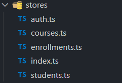

# Decisão da Arquitetura utilizada - Frontend
Optei por utilizar uma arquitetura que o vuetify nos fornece por padrão ao criar um novo projeto. Este que também já possui o Pinia para o gerenciamento de estados da aplicação, o que ajuda bastante no desenvolvimento.

## Estrutura de pastas
- ### pages
    - Componentes que representam uma rota completa (ex: StudentsPage.vue). São responsáveis por orquestrar a busca de dados e compor a tela usando componentes menores.
- ### components
    - Blocos de construção de UI genéricos e reutilizáveis (ex: EnrollmentModal.vue, HeaderTable.vue). Eles recebem dados via props e comunicam ações via emits, não devendo ter conhecimento do contexto da página.
- ### layouts
    - "Moldes" de página que definem a estrutura visual de seções da aplicação (ex: DefaultLayout.vue para a área logada, AuthLayout.vue para a área pública).

## Roteamento e layout dinâmico
- Utilizei o Vue Router com rotas aninhadas (children) para associar grupos de páginas a componentes de layout específicos.
- Este padrão é fundamental para o evitar a duplicação de código. 
    - Definimos uma rota pai (path: '/') que renderiza o DefaultLayout.vue. Todas as páginas seguras são filhas dessa rota e são renderizadas dentro do _**router-view**_ do layout.
    - O mesmo se aplica ao AuthLayout.vue para as páginas públicas. Isso centraliza a estrutura visual da aplicação.
- A proteção de rotas é feita através de um "Navigation Guard" global (router.beforeEach). 
    - Intercepta todas as navegações, verifica a meta field requiresAuth da rota e o estado de autenticação na auth store para permitir ou redirecionar o acesso, centralizando toda a lógica de segurança de rotas em um único lugar.

## Stores
- Como dito na introdução, o estado global da nossa aplicação é gerenciada pelo Pinia. 
- Pensei em uma abordagem que garante uma separação clara de responsabilidades, criando uma store única para os seus respectivos dados. Ex:

    

    - enrollments.ts cuida das matrículas, students.ts cuida dos alunos, enfim.
- A principal responsabilidade das stores é gerenciar as requisições à API

# Lista de bibliotecas de terceiros utilizadas
- Além das bibliotecas padrão que um novo projeto vuetify utiliza, precisei apenas do **axios**. Para realizar requisições http. 
